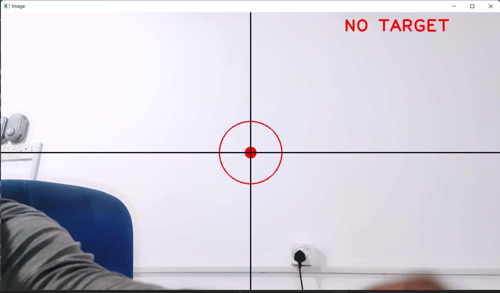
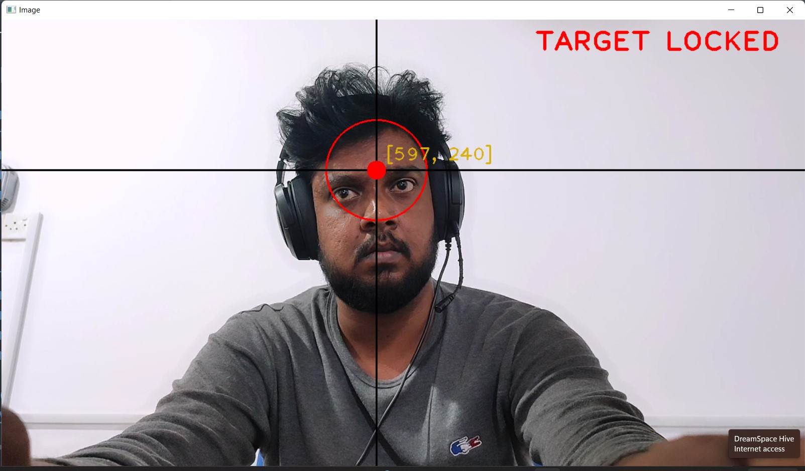

## Face Tracking with OpenCV Python and Arduino

### Introduction

This is a face tracking system with Opencv + Python and Arduino. It is for educational purpose only. It is using CVZONE module to detect face region and aim on the forehead of the face. It returns X,V coordinates that could be used to track the face using Arduino.

This simple prototype could be used to build highly security system for military purposes and usages.

### Programming Languages & Frameworks
- Python 3.8
- CVZONE Module

### Architecture Diagram


### Configuration and Setup

#### Run only detection

- Install OpenCV

  ```
    pip install opencv-python
  ```


  - Install cvzone

    ```
      pip install cvzone
    ```

### Execution and Running

#### Run only detection

- Open CMD and Type

  ```
    python 0-forhead-tracker-detection-only.py
  ```

#### Run with Arduino (X,V coordinates)

- Open CMD and Type

  ```
    python 1-severo-based-forehead-tracker.py

  ```

  ### Output







# CONTACT

### Website: 

[](http://www.gunarakulan.info)

### Social Media:

[](https://www.linkedin.com/in/gunarakulangunaretnam)
[](https://www.facebook.com/gunarakulangunaretnam)
[](https://wa.me/94740001141?text=WhatsApp%3A%20%2B9740001141)
[](https://www.instagram.com/gunarakulangunaretnam)
[](https://x.com/gunarakulangr)
[](https://www.kaggle.com/gunarakulangr)
[](https://www.tiktok.com/@gunarakulangunaretnam)
[](https://www.youtube.com/channel/UCjMOdgHFAjAdBKiqV8y2Tww)
